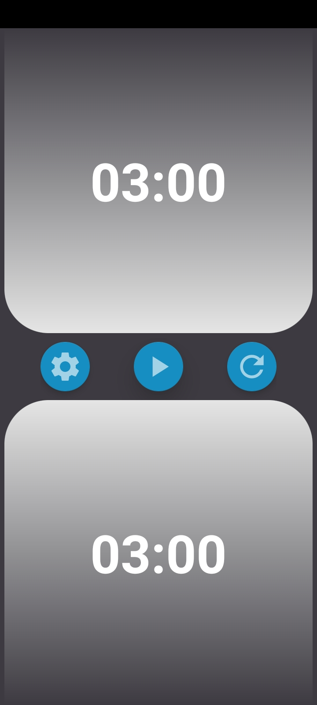
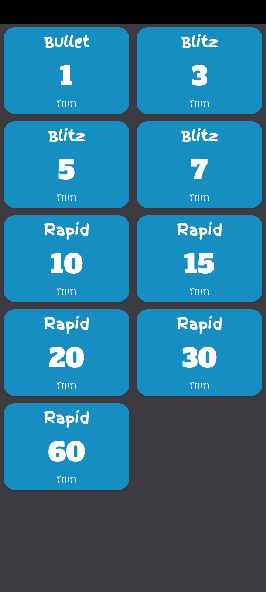
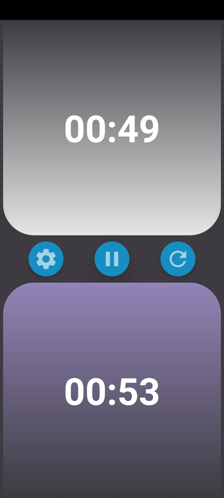
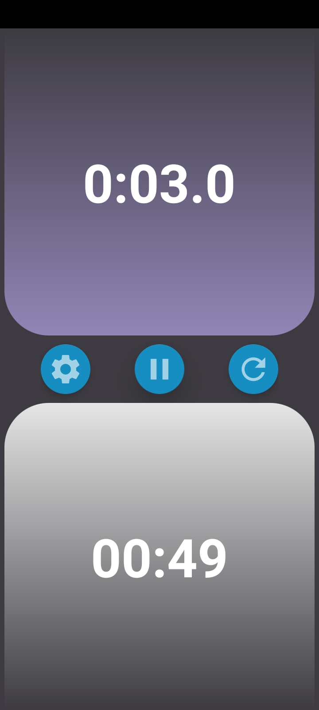
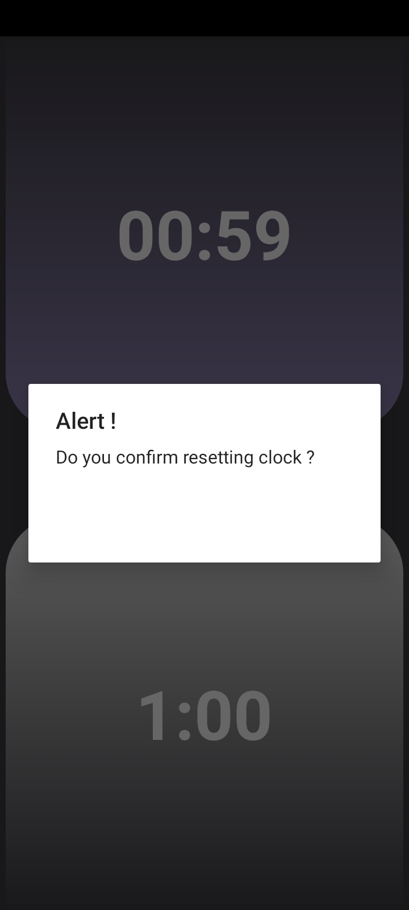
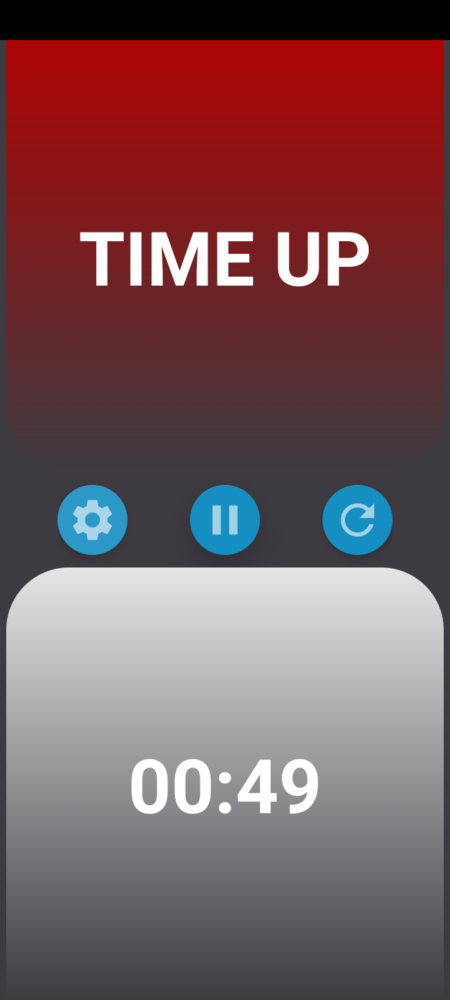

# Chess Clock
An android app, serving as a real chess clock.

### About
* The app works like a chess clock with various time controls used in Chess.
* Players need to tap the clock buttons everytime they make a move and if not checkmated, the player who loses all his time first, loses the game.

### Installing the app - 
The link to the APK file of the app is attached [here](https://drive.google.com/file/d/1EPTr5zCuTzvHRj1J8gLCXc0uD_n4cmed/view?usp=sharing) .
You need to "Allow Apps from unknown source" to install the apk and run the app on your android device.

### App Screens - 
* **Home Screen** - welcomes the user with a pre set clock for a 3 minutes game.

* **Settings Screen** - helps user choose from different time controls for the game, including Bullet, Blitz and Rapid games.

* **Game in Progress** - The players keep tapping after making their moves.

&nbsp;&nbsp;&nbsp;&nbsp;&nbsp;

* **Reset Alert** - The reset button prompts an alert dialog before players can reset the clock.

* **Game Over** - The clocks become inactive once any of the player lose his time and the game is over.

* **Demo** - the recording of the app in working is attached - 

